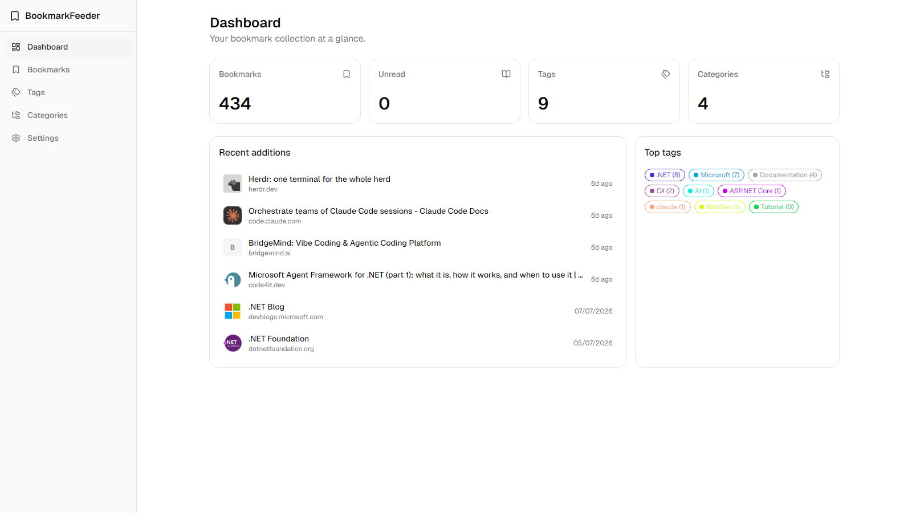
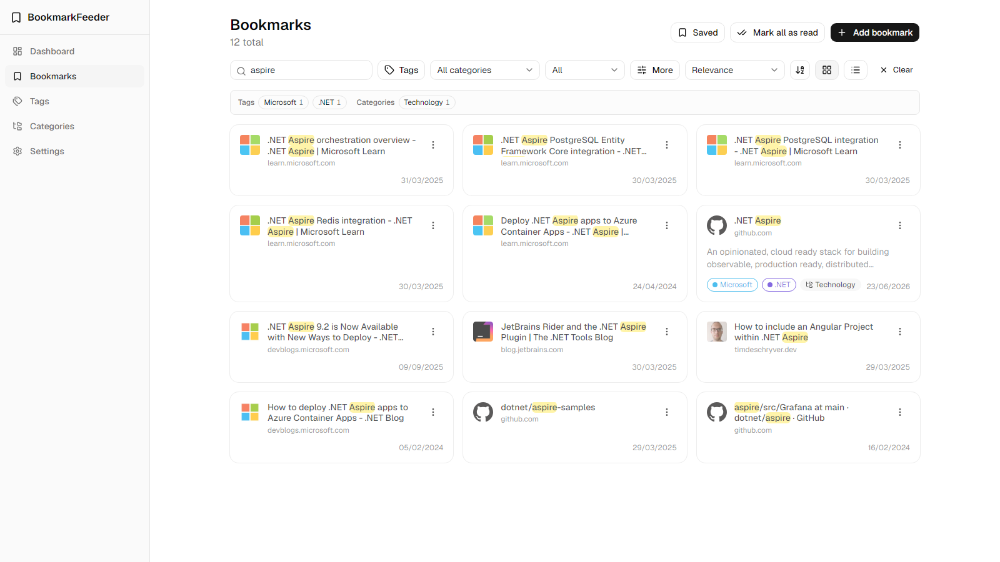

# BookmarkFeeder

A self-hosted, privacy-first bookmark manager — a Pocket alternative that runs on hardware you own.
Bulk-import your browser bookmarks with the extension, search them properly, and keep the lot on your
own NAS. Nothing leaves your network.



## Features

### Working today

- **Bulk sync from the browser** — a Chrome/Edge extension walks your chosen bookmark folders,
  uploads them in one batch, preserves the folder path, and skips anything already stored. Dedupe is
  by URL across the whole collection, so two browsers can feed one library safely.
- **Real search** — PostgreSQL full-text search over a weighted, GIN-indexed `tsvector`. Results are
  relevance-ranked (a title hit beats a URL hit), matched terms are highlighted, and tag/category
  facets narrow them down. It stems, so *testing* finds *Test Driven Development*. Searches can be
  saved and re-run.
- **Organise** — tags, a category tree, read/unread, an edit dialog, and "mark all as read" across
  every match rather than just the page you're looking at.
- **Favicons** — a background worker discovers each site's icon from **its own origin** (never a
  third-party favicon service) and records failures so it never re-asks.
- **Self-hostable** — four containers behind one YARP gateway, a single exposed port, `X-API-Key`
  auth, per-endpoint rate limits, health probes, and automatic EF migrations on start.

### Planned

- **AI categorisation** — LLM-suggested tags and categories with a review/approve workflow, behind a
  background job queue with cost controls.
- **Import/export** — browser HTML, Pocket and Instapaper in; JSON/HTML/CSV out.
- **Scheduled sync** — an MV3 service worker syncing on a timer instead of a button.
- **Optional multi-user** — currently single-tenant by design (one shared API key).

## Screenshots

Ranked search with highlighting and facets:



## Run it locally

**Prerequisites:** [.NET 10 SDK](https://dotnet.microsoft.com/download), Node.js 22+, and a container
runtime (Docker Desktop / Podman) for PostgreSQL.

```bash
cd BookmarkFeeder.Web && npm install && cd ..     # once
dotnet run --project BookmarkFeeder.AppHost
```

Aspire starts everything — Postgres, the API, the Vite dev server and the gateway — applies
migrations and seeds demo data.

| | |
|---|---|
| **The app** | <http://localhost:5180> — through the gateway, same as production |
| Aspire dashboard | <https://localhost:17127> (logs, traces, resource health) |

The dev API key is `dev-local-bookmarkfeeder-key`, pre-filled in dev builds.

Tests: `dotnet test` (the PostgreSQL integration tests need a container runtime; skip them with
`--filter Category!=Integration`) and `npm test` in `BookmarkFeeder.Web`.

## Self-hosting

Runs on any Docker host. Images are on Docker Hub (`linux/amd64`):

```
mgpeter/bookmarkfeeder-webapi    mgpeter/bookmarkfeeder-gateway    mgpeter/bookmarkfeeder-web
```

```bash
# copy docker/docker-compose.yaml and docker/.env.nas.template to the host
cp .env.nas.template .env              # next to docker-compose.yaml
# set API_KEY, POSTGRES_PASSWORD, GATEWAY_PORT and the three image tags
docker compose up -d
```

Then open `http://<host>:8081` and paste your API key into Settings.

What you should know:

- **Only the gateway is exposed.** `webapi`, `web` and `postgres` stay on an internal network.
  `/api` routes to the API, everything else to the static web app — one origin, no CORS.
- **Migrations apply on start.** No manual schema step, on first run or after an upgrade.
- **Your data is a directory**, not a hidden Docker volume: `POSTGRES_DATA_PATH` (default
  `./data/postgres` beside the compose file). **It is the only thing worth backing up** — everything
  else rebuilds from images.
- **Deploy by version tag, never `:latest`**, so "which build is running?" has an answer.
- **TLS is not included.** Put your own reverse proxy in front if you want HTTPS.
- The API key is the *only* thing protecting your collection. Generate a real one:
  `openssl rand -base64 32`.

[**docs/deployment.md**](docs/deployment.md) is a full walkthrough for a Synology NAS, including
where things live and how to update.

## Building and releasing

The compose file is **generated from the Aspire AppHost** — `BookmarkFeeder.AppHost/Program.cs` is the
single source of truth for topology, ports, restart policies and healthchecks. Never edit
`docker/docker-compose.yaml` by hand.

```bash
./scripts/docker-compose-generate.sh          # AppHost -> docker/docker-compose.yaml
./scripts/docker-compose-generate.sh --check  # fails if the committed compose has drifted
./scripts/docker-build.sh                     # build all three images at the current VERSION
./scripts/docker-release.sh --minor           # bump VERSION, build, push :<version> and :latest
```

`.ps1` equivalents exist for every script. The version lives in `VERSION` at the repo root and is
written **only after a successful push**. See [scripts/README.md](scripts/README.md).

## Project structure

| Path | |
|---|---|
| `BookmarkFeeder.AppHost` | Aspire orchestration; also the source of the compose file |
| `BookmarkFeeder.Gateway` | YARP reverse proxy — the single entry point (`/api` → API, `/` → web) |
| `BookmarkFeeder.WebApi` | Minimal API, EF Core, full-text search, favicon worker |
| `BookmarkFeeder.Web` | React + Vite web app ([readme](BookmarkFeeder.Web/README.md)) |
| `BookmarkFeeder.BrowserExtension` | Chrome/Edge MV3 extension ([readme](BookmarkFeeder.BrowserExtension/README.md)) |
| `BookmarkFeeder.ServiceDefaults` | Shared telemetry, health checks, resilience |
| `BookmarkFeeder.WebApi.Tests` | xUnit — unit + Testcontainers integration tests |
| `docker/` | Generated compose + `.env` templates |
| `scripts/` | Build, release and compose-generation scripts |
| `docs/` | Deployment guide, product docs, specs |

## Tech stack

**Backend** — .NET 10 Minimal APIs, Aspire 13, EF Core 10 (DbContext factory, no generic
repositories), PostgreSQL 18, FluentValidation, OpenAPI + Scalar.
**Frontend** — React 19, Vite 8, TypeScript, Tailwind v4, shadcn/ui, TanStack Query, React Router.
**Extension** — Chrome/Edge Manifest V3, React + Vite + shadcn via `@crxjs/vite-plugin`.
**Infrastructure** — YARP gateway, Docker Compose, Docker Hub, Testcontainers.

Full list: [docs/product/tech-stack.md](docs/product/tech-stack.md).

## Docs

- [Deployment](docs/deployment.md) — self-hosting walkthrough
- [Scripts](scripts/README.md) — build and release
- [Specs](docs/specs/README.md) — what's shipped, what's planned, and the known issues
- [Roadmap](docs/product/roadmap.md) · [Mission](docs/product/mission.md) ·
  [Decisions](docs/product/decisions.md)

## License

[MIT](LICENSE) © Piotr Wieszyński
