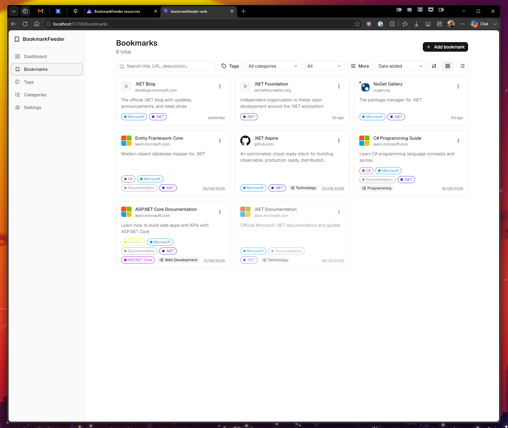

# BookmarkFeeder

A self-hosted, privacy-first bookmark manager. Bulk-import your browser bookmarks with a
companion extension into a server you control, then organize, filter, and rediscover them
through a fast React web app. Your data stays on your own instance.



## Features

### Web app

- Dashboard with stat cards (total bookmarks, unread, tags, categories), recent additions, and a top-tags cloud
- Bookmark browser with grid and list views, pagination, and favicon previews
- Rich, URL-driven filtering and sorting: full-text search across title, URL, and description; multi-select tags; hierarchical categories; read/unread; source folder; date range; sort by date, title, or URL
- Add, edit, delete bookmarks, and toggle read/unread inline
- Tag management with optional colors and per-tag counts
- Hierarchical category management with reassignment on delete
- Dark and light themes

### Browser extension

- Pick specific bookmark folders to sync
- One-click sync to your server with automatic duplicate skipping
- Preserves the original folder path and date added
- Tracks and displays the last sync time

### Backend

- ASP.NET Core Minimal API with a batch endpoint for extension sync
- PostgreSQL storage via Entity Framework Core, with automatic migrations
- Shared API-key authentication on every route
- OpenAPI schema plus a Scalar API reference in development

## Tech stack

- **Orchestration:** .NET Aspire (AppHost + service defaults)
- **Backend:** ASP.NET Core Minimal API, .NET 10, EF Core 10, FluentValidation
- **Database:** PostgreSQL
- **Frontend:** React 19, TypeScript, Vite, Tailwind CSS v4, shadcn/ui on Radix, TanStack Query, React Router, react-hook-form + Zod
- **Extension:** Chrome/Edge Manifest V3, vanilla JavaScript

## Getting started

### Prerequisites

- .NET 10 SDK
- Docker (or Podman) for the PostgreSQL container
- Node.js and npm for the web app

### Run the Aspire dashboard

Install the web app dependencies once:

```bash
cd BookmarkFeeder.Web
npm install
```

Then, from the repository root, start everything with the Aspire AppHost:

```bash
dotnet run --project BookmarkFeeder.AppHost
```

This launches the PostgreSQL container, the API, and the Vite web app together, and opens the
Aspire dashboard at <https://localhost:17127> (or <http://localhost:15022> with the `http` profile).
From the dashboard you can reach the running resources, including the web frontend and the Scalar
API reference at `/scalar` on the API. The database is migrated and seeded automatically in
development.

## Project structure

- `BookmarkFeeder.AppHost` - .NET Aspire orchestrator (local dev entry point)
- `BookmarkFeeder.WebApi` - ASP.NET Core Minimal API backend
- `BookmarkFeeder.ServiceDefaults` - shared Aspire health checks, telemetry, and resilience
- `BookmarkFeeder.Web` - React web application
- `BookmarkFeeder.BrowserExtension` - Chrome/Edge sync extension
- `BookmarkFeeder.WebApi.Tests` - integration tests

## Browser extension

The sync extension has its own setup and usage guide in
[BookmarkFeeder.BrowserExtension/README.md](BookmarkFeeder.BrowserExtension/README.md).

## Roadmap

AI-assisted auto-categorization of imported bookmarks is planned.
